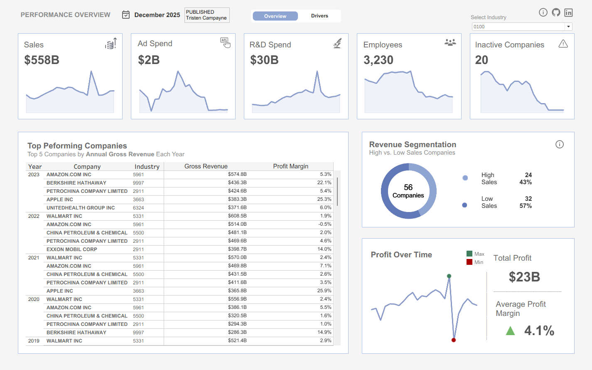
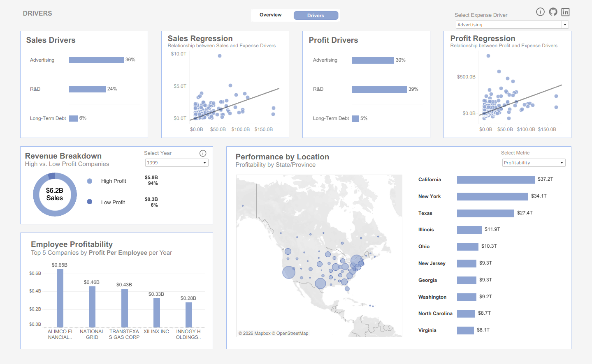

# Company Performance Dashboard (Tableau)

## 📊 Overview
An interactive Tableau dashboard analyzing 20+ years of company financial performance across industries. 
The project focuses on revenue, profitability, R&D, advertising spend, employee efficiency, and geographic performance.

## 🎯 Business Questions
- How have key business metrics changed over time across industries?
- What drives revenue and profit across industries?
- How do high-profit companies differ from low-profit companies?
- Which expense categories most strongly impact profitability?
- How does performance vary by location?
- How can companies maximize their profit?

## 🛠 Tools & Skills
- Tableau (Calculated Fields, Parameters, Sets, LOD Expressions)
- Data Cleaning (SQL & Excel)
- Data Visualization & Dashboard Design
- Regression Analysis
- Financial & Profitability Analysis

## 🧹 Data Cleaning & Preparation

### Missing Values
Several financial and company-level fields (Assets, Cash, Long-Term Debt, Net Income, Sales, R&D, and State/Province) contained missing values. Tableau automatically treats these as `NULL`. These values were left unchanged unless required for specific calculations to avoid introducing bias or artificial assumptions.

### Outliers
Large spikes in sales, expenses, and profit were retained, as they reflect legitimate performance from large-cap firms rather than data errors. Removing these values would have distorted industry-level and aggregate analyses.

### Inconsistent Entries
The *Employees* field contained decimal values due to source formatting issues. Employee counts were rounded to whole numbers in Excel prior to ingestion to ensure logical consistency.

### Data Types & Structure
- Year fields were standardized and treated consistently for time-series analysis.
- Financial metrics were enforced as continuous measures to support aggregation, trend analysis, and regression modeling in Tableau.

### Financial Scale Normalization
Most monetary fields in the raw dataset were recorded in **millions**, which limited interpretability at higher aggregation levels. To improve clarity and executive readability:
- All financial measures were dynamically converted to **millions, billions, or trillions** using SQL-style logic in Tableau calculated fields.
- These calculations ensured consistent scaling across KPIs, charts, tooltips, and dashboards while preserving underlying values.

> Example logic used for financial scaling:
> - Convert values dynamically based on magnitude (Millions → Billions → Trillions)
> - Conditional logic ensured both positive and negative values retained correct scale formatting.
> - Applied consistently across KPIs and tooltips

### Exclusions
Companies lacking meaningful or sufficient financial data were excluded to prevent skewed results and ensure analytical integrity.

## 📌 Key Features
- KPI overview with trend sparklines
- Revenue segmentation (High vs. Low Sales Companies)
- Profit drivers & regression analysis
- Profitability by state/province (interactive map)
- Employee profitability ranking
- Dynamic year and metric parameters

## 📷 Dashboard Preview

## 📂 How to View
1. Download the `.twbx` file
2. Open using **Tableau Public** or **Tableau Desktop**

## 👤 Author
Tristen Campayne  
